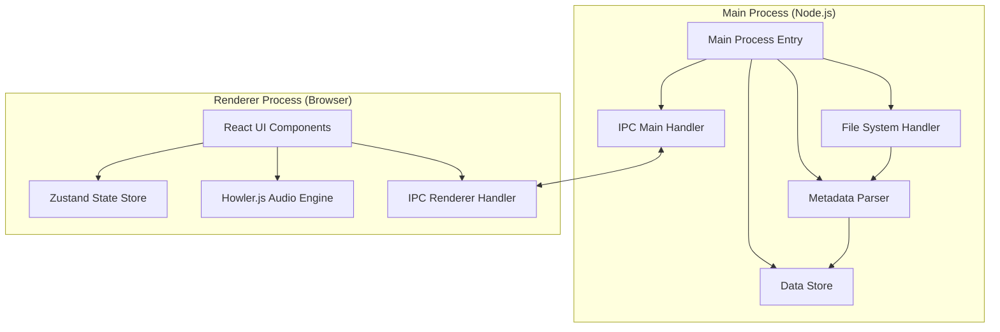
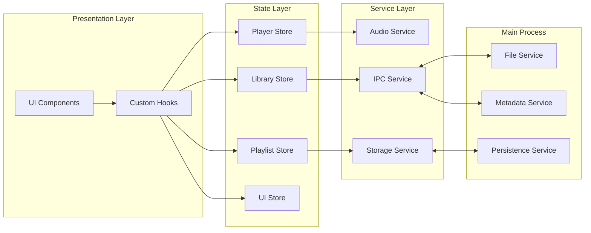

# Design Document: Local Music Player

## Overview

本文档描述了一个基于 Electron + React + TypeScript 的本地音乐播放器的技术设计。该应用采用现代化的技术栈，提供流畅的用户体验，支持大规模音乐库管理和高性能音频播放。

### 技术栈

- **框架**: Electron + Vite + React 18 + TypeScript
- **UI 库**: Tailwind CSS + shadcn/ui
- **状态管理**: Zustand
- **音频引擎**: Howler.js
- **元数据解析**: music-metadata
- **列表虚拟化**: react-virtuoso
- **数据持久化**: electron-store
- **打包工具**: electron-builder

### 设计原则

1. **进程分离**: 主进程负责文件系统操作和元数据解析，渲染进程负责 UI 和音频播放
2. **状态集中管理**: 使用 Zustand 管理全局状态，保持数据流清晰
3. **性能优先**: 虚拟化长列表，异步加载封面，后台扫描文件
4. **类型安全**: 全面使用 TypeScript，确保类型安全
5. **模块化设计**: 清晰的模块边界，便于维护和扩展

## Architecture

### 进程架构



### 模块架构



## Components and Interfaces

### 1. Main Process Components

#### 1.1 File Service

负责文件系统操作，包括文件夹扫描、文件读取等。

```typescript
interface FileService {
  // 扫描文件夹，返回所有音频文件路径
  scanFolder(folderPath: string): Promise<string[]>

  // 检查路径是否存在
  pathExists(path: string): Promise<boolean>

  // 监听文件夹变化
  watchFolder(folderPath: string, callback: (event: FileChangeEvent) => void): void

  // 停止监听文件夹
  unwatchFolder(folderPath: string): void
}

interface FileChangeEvent {
  type: 'added' | 'removed' | 'modified'
  filePath: string
}
```

#### 1.2 Metadata Service

负责解析音频文件元数据。

```typescript
interface MetadataService {
  // 解析单个文件的元数据
  parseFile(filePath: string): Promise<TrackMetadata>

  // 批量解析文件元数据
  parseFiles(filePaths: string[]): Promise<TrackMetadata[]>

  // 提取封面图片
  extractCover(filePath: string): Promise<Buffer | null>
}

interface TrackMetadata {
  filePath: string
  title: string
  artist: string
  album: string
  albumArtist?: string
  year?: number
  genre?: string
  duration: number // 秒
  trackNumber?: number
  diskNumber?: number
  coverData?: Buffer
  format: string // mp3, flac, wav, etc.
  bitrate?: number
  sampleRate?: number
}
```

#### 1.3 Persistence Service

负责数据持久化，使用 electron-store。

```typescript
interface PersistenceService {
  // 保存音乐库配置
  saveLibraryConfig(config: LibraryConfig): Promise<void>

  // 加载音乐库配置
  loadLibraryConfig(): Promise<LibraryConfig>

  // 保存播放列表
  savePlaylists(playlists: Playlist[]): Promise<void>

  // 加载播放列表
  loadPlaylists(): Promise<Playlist[]>

  // 保存应用设置
  saveSettings(settings: AppSettings): Promise<void>

  // 加载应用设置
  loadSettings(): Promise<AppSettings>

  // 保存播放状态
  savePlaybackState(state: PlaybackState): Promise<void>

  // 加载播放状态
  loadPlaybackState(): Promise<PlaybackState>
}

interface LibraryConfig {
  folders: FolderInfo[]
  tracks: TrackMetadata[]
  lastScanTime: number
}

interface FolderInfo {
  id: string
  path: string
  name: string
  addedAt: number
  trackCount: number
}

interface AppSettings {
  volume: number
  playbackMode: 'sequential' | 'shuffle' | 'repeat-one' | 'repeat-all'
  theme: 'light' | 'dark' | 'system'
}

interface PlaybackState {
  currentTrackId?: string
  position: number
  queue: string[]
  queueIndex: number
}
```

### 2. Renderer Process Components

#### 2.1 Audio Service

封装 Howler.js，提供音频播放功能。

```typescript
interface AudioService {
  // 加载音频文件
  load(filePath: string): Promise<void>

  // 播放
  play(): void

  // 暂停
  pause(): void

  // 停止
  stop(): void

  // 跳转到指定位置（秒）
  seek(position: number): void

  // 获取当前播放位置（秒）
  getPosition(): number

  // 设置音量（0-1）
  setVolume(volume: number): void

  // 获取音量
  getVolume(): number

  // 获取时长（秒）
  getDuration(): number

  // 监听播放结束事件
  onEnd(callback: () => void): void

  // 监听播放错误事件
  onError(callback: (error: Error) => void): void

  // 监听播放进度事件
  onProgress(callback: (position: number) => void): void

  // 清理资源
  dispose(): void
}
```

#### 2.2 IPC Service

封装 IPC 通信，提供类型安全的 API。

```typescript
interface IPCService {
  // 文件夹操作
  selectFolder(): Promise<string | null>
  scanFolder(folderPath: string): Promise<string[]>

  // 元数据操作
  parseFile(filePath: string): Promise<TrackMetadata>
  parseFiles(filePaths: string[]): Promise<TrackMetadata[]>
  extractCover(filePath: string): Promise<string | null> // base64

  // 持久化操作
  saveLibraryConfig(config: LibraryConfig): Promise<void>
  loadLibraryConfig(): Promise<LibraryConfig>
  savePlaylists(playlists: Playlist[]): Promise<void>
  loadPlaylists(): Promise<Playlist[]>
  saveSettings(settings: AppSettings): Promise<void>
  loadSettings(): Promise<AppSettings>
  savePlaybackState(state: PlaybackState): Promise<void>
  loadPlaybackState(): Promise<PlaybackState>
}
```

#### 2.3 Zustand Stores

##### Player Store

管理播放器状态。

```typescript
interface PlayerStore {
  // 状态
  currentTrack: TrackMetadata | null
  isPlaying: boolean
  position: number
  duration: number
  volume: number
  playbackMode: 'sequential' | 'shuffle' | 'repeat-one' | 'repeat-all'
  queue: TrackMetadata[]
  queueIndex: number

  // 操作
  play: (track?: TrackMetadata) => void
  pause: () => void
  stop: () => void
  next: () => void
  previous: () => void
  seek: (position: number) => void
  setVolume: (volume: number) => void
  setPlaybackMode: (mode: 'sequential' | 'shuffle' | 'repeat-one' | 'repeat-all') => void
  setQueue: (tracks: TrackMetadata[], startIndex?: number) => void
  addToQueue: (track: TrackMetadata) => void
  removeFromQueue: (index: number) => void
  clearQueue: () => void
  updatePosition: (position: number) => void
}
```

##### Library Store

管理音乐库状态。

```typescript
interface LibraryStore {
  // 状态
  folders: FolderInfo[]
  tracks: TrackMetadata[]
  isScanning: boolean
  scanProgress: number
  searchQuery: string
  filteredTracks: TrackMetadata[]

  // 操作
  addFolder: (folderPath: string) => Promise<void>
  removeFolder: (folderId: string) => Promise<void>
  refreshFolder: (folderId: string) => Promise<void>
  setSearchQuery: (query: string) => void
  loadLibrary: () => Promise<void>

  // 计算属性
  getTracksByFolder: (folderId: string) => TrackMetadata[]
  getTracksByAlbum: (album: string) => TrackMetadata[]
  getTracksByArtist: (artist: string) => TrackMetadata[]
  getAlbums: () => Album[]
  getArtists: () => Artist[]
}

interface Album {
  name: string
  artist: string
  year?: number
  trackCount: number
  tracks: TrackMetadata[]
  coverData?: string // base64
}

interface Artist {
  name: string
  albumCount: number
  trackCount: number
  albums: Album[]
}
```

##### Playlist Store

管理播放列表状态。

```typescript
interface PlaylistStore {
  // 状态
  playlists: Playlist[]
  currentPlaylistId: string | null

  // 操作
  createPlaylist: (name: string) => void
  deletePlaylist: (playlistId: string) => void
  renamePlaylist: (playlistId: string, newName: string) => void
  addTrackToPlaylist: (playlistId: string, track: TrackMetadata) => void
  removeTrackFromPlaylist: (playlistId: string, trackIndex: number) => void
  reorderPlaylistTracks: (playlistId: string, fromIndex: number, toIndex: number) => void
  loadPlaylists: () => Promise<void>
  savePlaylists: () => Promise<void>
}

interface Playlist {
  id: string
  name: string
  tracks: TrackMetadata[]
  createdAt: number
  updatedAt: number
}
```

##### UI Store

管理 UI 状态。

```typescript
interface UIStore {
  // 状态
  currentView: 'library' | 'playlists' | 'albums' | 'artists' | 'queue'
  sidebarCollapsed: boolean
  queueVisible: boolean
  theme: 'light' | 'dark' | 'system'

  // 操作
  setCurrentView: (view: 'library' | 'playlists' | 'albums' | 'artists' | 'queue') => void
  toggleSidebar: () => void
  toggleQueue: () => void
  setTheme: (theme: 'light' | 'dark' | 'system') => void
}
```

### 3. UI Components

#### 3.1 Layout Components

- **AppLayout**: 应用主布局，包含侧边栏、主内容区、播放控制栏
- **Sidebar**: 侧边栏，显示导航菜单
- **MainContent**: 主内容区，根据当前视图显示不同内容
- **PlayerBar**: 播放控制栏，显示当前播放信息和控制按钮

#### 3.2 Library Components

- **LibraryView**: 音乐库视图
- **FolderList**: 文件夹列表
- **TrackList**: 歌曲列表（使用 react-virtuoso 虚拟化）
- **AlbumGrid**: 专辑网格
- **ArtistList**: 艺术家列表
- **SearchBar**: 搜索栏

#### 3.3 Player Components

- **PlaybackControls**: 播放控制按钮（播放/暂停、上一曲、下一曲）
- **ProgressBar**: 进度条
- **VolumeControl**: 音量控制
- **PlaybackModeToggle**: 播放模式切换
- **NowPlaying**: 当前播放信息显示

#### 3.4 Playlist Components

- **PlaylistView**: 播放列表视图
- **PlaylistList**: 播放列表列表
- **PlaylistDetail**: 播放列表详情
- **CreatePlaylistDialog**: 创建播放列表对话框

#### 3.5 Queue Components

- **QueuePanel**: 播放队列面板
- **QueueItem**: 队列项
- **QueueControls**: 队列控制按钮

## Data Models

### Track Model

```typescript
interface Track {
  id: string // 使用文件路径的 hash 作为 ID
  filePath: string
  title: string
  artist: string
  album: string
  albumArtist?: string
  year?: number
  genre?: string
  duration: number
  trackNumber?: number
  diskNumber?: number
  coverUrl?: string // base64 或 blob URL
  format: string
  bitrate?: number
  sampleRate?: number
  addedAt: number
  folderId: string
}
```

### Folder Model

```typescript
interface Folder {
  id: string
  path: string
  name: string
  addedAt: number
  trackCount: number
  lastScanTime: number
}
```

### Playlist Model

```typescript
interface Playlist {
  id: string
  name: string
  trackIds: string[]
  createdAt: number
  updatedAt: number
}
```

### Playback State Model

```typescript
interface PlaybackState {
  currentTrackId: string | null
  position: number
  isPlaying: boolean
  volume: number
  playbackMode: 'sequential' | 'shuffle' | 'repeat-one' | 'repeat-all'
  queueTrackIds: string[]
  queueIndex: number
}
```

## Correctness Properties

_属性（Property）是关于系统行为的形式化陈述，应该在所有有效执行中保持为真。属性是人类可读规范和机器可验证正确性保证之间的桥梁。_

### 核心属性

#### Property 1: 文件夹扫描完整性

*对于任意*包含音频文件的文件夹，扫描后应该发现所有支持格式的音频文件，并为每个文件解析元数据
**Validates: Requirements 1.1, 1.2**

#### Property 2: 数据持久化往返一致性

*对于任意*音乐库配置、播放列表或播放状态，保存后重新加载应该得到等价的数据
**Validates: Requirements 1.3, 9.2**

#### Property 3: 不支持文件跳过

*对于任意*包含不支持文件的文件夹，扫描时应该跳过不支持的文件并继续处理其他文件
**Validates: Requirements 1.5**

#### Property 4: 文件夹删除完整性

*对于任意*音乐库中的文件夹，删除后该文件夹及其所有音频文件都不应出现在库中
**Validates: Requirements 2.3**

#### Property 5: 文件夹刷新同步性

*对于任意*文件夹，刷新后库中的数据应该与文件系统的实际状态一致
**Validates: Requirements 2.4, 2.6**

#### Property 6: 播放状态转换

*对于任意*音频文件，播放操作应该将播放状态设置为 playing，暂停操作应该保持当前位置
**Validates: Requirements 3.1, 3.2**

#### Property 7: 队列导航正确性

*对于任意*播放队列，下一曲操作应该增加队列索引，上一曲操作应该减少队列索引（在有效范围内）
**Validates: Requirements 3.3, 3.4**

#### Property 8: 播放位置控制

*对于任意*有效的播放位置值，seek 操作应该将当前播放位置更新为指定值
**Validates: Requirements 3.5**

#### Property 9: 音量控制范围

*对于任意*0 到 1 之间的音量值，设置音量应该将音量更新为指定值
**Validates: Requirements 3.6**

#### Property 10: 播放模式行为

*对于任意*播放队列和播放模式，当歌曲播放完成时，应该根据模式执行相应操作（顺序播放下一首、随机选择、重复当前、循环队列）
**Validates: Requirements 3.7, 7.1, 7.2, 7.3, 7.4**

#### Property 11: 播放列表添加操作

*对于任意*播放列表和歌曲，添加歌曲后播放列表长度应该增加 1，且歌曲应该出现在列表末尾
**Validates: Requirements 4.2**

#### Property 12: 播放列表删除不影响原文件

*对于任意*播放列表中的歌曲，从播放列表删除后，歌曲应该从列表中移除但原始文件应该仍然存在于音乐库中
**Validates: Requirements 4.3**

#### Property 13: 播放列表重排序

*对于任意*播放列表，重排序操作应该改变歌曲顺序但不改变歌曲集合
**Validates: Requirements 4.6**

#### Property 14: 播放列表修改持久化

*对于任意*播放列表修改操作（添加、删除、重排序），修改后应该立即持久化到存储
**Validates: Requirements 4.7, 9.3**

#### Property 15: 搜索结果匹配性

*对于任意*搜索关键词，所有搜索结果的标题、艺术家或专辑名称都应该包含该关键词
**Validates: Requirements 5.1, 5.6**

#### Property 16: 筛选结果正确性

*对于任意*艺术家或专辑筛选条件，所有筛选结果都应该属于指定的艺术家或专辑
**Validates: Requirements 5.4, 5.5**

#### Property 17: 搜索清空恢复

*对于任意*搜索状态，清空搜索框应该恢复到搜索前的视图状态
**Validates: Requirements 5.3**

#### Property 18: 播放队列添加

*对于任意*歌曲，添加到队列末尾应该将歌曲放在队列最后位置
**Validates: Requirements 6.6**

#### Property 19: 下一首播放插入

*对于任意*歌曲，选择"下一首播放"应该将歌曲插入到当前播放歌曲之后的位置
**Validates: Requirements 6.7**

#### Property 20: 队列清空操作

*对于任意*播放队列，清空操作应该使队列为空并停止播放
**Validates: Requirements 6.5**

#### Property 21: 播放模式持久化

*对于任意*播放模式更改，新的播放模式应该立即保存到存储
**Validates: Requirements 7.6**

#### Property 22: 封面显示降级

*对于任意*音频文件，如果有嵌入封面则显示封面，否则显示默认占位图
**Validates: Requirements 8.4**

#### Property 23: 应用状态持久化往返

*对于任意*应用关闭时的状态，重新打开应用后应该恢复到相同的播放状态和音乐库数据
**Validates: Requirements 9.1, 9.2**

#### Property 24: 封面缓存一致性

*对于任意*已加载的封面图片，再次请求相同封面应该从缓存返回而不是重新加载
**Validates: Requirements 10.3**

#### Property 25: 播放错误恢复

*对于任意*无法播放的音频文件，应该显示错误消息并尝试播放队列中的下一首
**Validates: Requirements 3.8, 11.1**

#### Property 26: 路径错误处理

*对于任意*不存在或无法访问的文件夹路径，应该提示用户错误并提供移除选项
**Validates: Requirements 11.2**

#### Property 27: 元数据解析降级

*对于任意*元数据解析失败的音频文件，应该使用文件名作为标题并继续处理
**Validates: Requirements 11.3**

#### Property 28: 数据损坏恢复

*对于任意*损坏或不可读的存储数据，应该使用默认配置并通知用户
**Validates: Requirements 9.5**

#### Property 29: 数据迁移正确性

*对于任意*旧格式的数据，升级后应该正确迁移到新格式并保持数据完整性
**Validates: Requirements 9.6**

#### Property 30: 离线功能可用性

*对于任意*网络不可用的情况，应用应该继续提供所有本地功能而不中断
**Validates: Requirements 11.6**

#### Property 31: 键盘快捷键响应

*对于任意*定义的键盘快捷键，按下时应该触发相应的操作（播放/暂停、搜索、创建播放列表等）
**Validates: Requirements 12.1, 12.6, 12.7, 12.8**

#### Property 32: 方向键控制

*对于任意*播放状态，左右箭头键应该调整播放位置，上下箭头键应该调整音量
**Validates: Requirements 12.2, 12.3, 12.4, 12.5**

## Error Handling

### 文件系统错误

1. **文件不存在**: 当音频文件被外部删除时，显示错误提示并从库中移除该文件
2. **文件夹不可访问**: 当文件夹路径无效或权限不足时，提示用户并提供移除选项
3. **磁盘空间不足**: 当存储空间不足时，通知用户并尝试清理缓存

### 音频播放错误

1. **格式不支持**: 当音频格式不被 Howler.js 支持时，跳过该文件并播放下一首
2. **文件损坏**: 当音频文件损坏无法播放时，显示错误并尝试播放下一首
3. **解码错误**: 当音频解码失败时，记录错误日志并继续播放队列

### 元数据解析错误

1. **元数据缺失**: 当音频文件没有元数据时，使用文件名作为标题
2. **编码错误**: 当元数据编码不正确时，尝试多种编码方式解析
3. **封面提取失败**: 当无法提取封面时，使用默认占位图

### 数据持久化错误

1. **存储写入失败**: 当无法写入存储时，在内存中保持数据并定期重试
2. **数据损坏**: 当读取到损坏的数据时，使用默认配置并通知用户
3. **版本不兼容**: 当数据格式版本不兼容时，尝试自动迁移或使用默认配置

### IPC 通信错误

1. **超时**: 当 IPC 调用超时时，显示错误提示并允许用户重试
2. **进程崩溃**: 当主进程或渲染进程崩溃时，尝试恢复状态
3. **消息丢失**: 当 IPC 消息丢失时，实现重试机制

### 用户输入错误

1. **无效输入**: 当用户输入无效数据时，显示验证错误提示
2. **重复操作**: 当用户尝试重复添加文件夹时，提示已存在
3. **空值处理**: 当用户提交空值时，阻止操作并提示用户

## Testing Strategy

### 测试方法

本项目采用**双重测试策略**，结合单元测试和基于属性的测试（Property-Based Testing, PBT）：

- **单元测试**: 验证特定示例、边缘情况和错误条件
- **属性测试**: 验证通用属性在所有输入下都成立
- 两者互补，共同提供全面的测试覆盖

### 属性测试配置

- **测试库**: 使用 [fast-check](https://github.com/dubzzz/fast-check) 进行属性测试
- **迭代次数**: 每个属性测试至少运行 100 次迭代
- **标签格式**: 每个属性测试必须包含注释标签：`Feature: local-music-player, Property {number}: {property_text}`
- **需求追溯**: 每个属性测试必须引用其验证的设计文档属性编号

### 测试范围

#### 1. 主进程测试

**File Service 测试**:

- 单元测试: 测试特定文件夹结构的扫描
- 属性测试: Property 1（文件夹扫描完整性）、Property 3（不支持文件跳过）

**Metadata Service 测试**:

- 单元测试: 测试特定音频文件的元数据解析
- 属性测试: Property 27（元数据解析降级）

**Persistence Service 测试**:

- 单元测试: 测试特定数据的保存和加载
- 属性测试: Property 2（数据持久化往返一致性）、Property 28（数据损坏恢复）、Property 29（数据迁移正确性）

#### 2. 渲染进程测试

**Audio Service 测试**:

- 单元测试: 测试播放、暂停、停止等基本操作
- 属性测试: Property 6（播放状态转换）、Property 8（播放位置控制）、Property 9（音量控制范围）

**Player Store 测试**:

- 单元测试: 测试特定播放场景
- 属性测试: Property 7（队列导航正确性）、Property 10（播放模式行为）、Property 20（队列清空操作）

**Library Store 测试**:

- 单元测试: 测试特定库操作
- 属性测试: Property 4（文件夹删除完整性）、Property 5（文件夹刷新同步性）、Property 15（搜索结果匹配性）、Property 16（筛选结果正确性）

**Playlist Store 测试**:

- 单元测试: 测试特定播放列表操作
- 属性测试: Property 11（播放列表添加操作）、Property 12（播放列表删除不影响原文件）、Property 13（播放列表重排序）、Property 14（播放列表修改持久化）

#### 3. 集成测试

- IPC 通信测试: 测试主进程和渲染进程之间的通信
- 端到端流程测试: 测试完整的用户操作流程（添加文件夹 → 扫描 → 播放）
- 错误恢复测试: 测试各种错误场景下的恢复机制

#### 4. UI 组件测试

- 使用 React Testing Library 进行组件测试
- 测试用户交互和状态更新
- 测试键盘快捷键响应（Property 31、Property 32）

### 测试数据生成

对于属性测试，使用 fast-check 的生成器创建随机测试数据：

- **文件路径生成器**: 生成有效的文件系统路径
- **音频元数据生成器**: 生成随机但有效的音频元数据
- **播放列表生成器**: 生成随机播放列表结构
- **播放队列生成器**: 生成随机播放队列

### 性能测试

虽然性能需求（Requirements 10.1-10.6）不适合单元测试，但应该进行以下性能验证：

- 启动时间测试: 验证应用在 3 秒内启动
- 大列表渲染测试: 验证 1000+ 歌曲列表的渲染性能
- 扫描性能测试: 验证大型文件夹扫描不阻塞 UI
- 歌曲切换延迟测试: 验证切换歌曲在 500ms 内开始播放

### 测试覆盖率目标

- 代码覆盖率: 至少 80%
- 属性测试覆盖: 所有核心业务逻辑
- 边缘情况覆盖: 所有已知的边缘情况和错误条件

### 持续集成

- 在 CI/CD 流程中自动运行所有测试
- 属性测试失败时，保存失败的反例用于回归测试
- 定期运行性能测试并跟踪性能指标

## Implementation Notes

### 技术选型理由

1. **Electron + Vite**: 快速的开发体验和热重载支持
2. **Howler.js**: 成熟的音频库，支持多种格式和跨平台
3. **music-metadata**: 强大的元数据解析能力，支持多种音频格式
4. **Zustand**: 轻量级状态管理，API 简洁，性能优秀
5. **react-virtuoso**: 高性能虚拟化列表，支持动态高度
6. **electron-store**: 简单易用的持久化方案，自动处理序列化

### 性能优化策略

1. **虚拟化长列表**: 使用 react-virtuoso 只渲染可见项
2. **异步加载**: 封面图片、元数据解析都采用异步加载
3. **Web Worker**: 在 Web Worker 中执行耗时的元数据解析
4. **缓存策略**: 缓存封面图片、搜索结果等
5. **防抖和节流**: 对搜索输入、滚动事件等进行防抖/节流处理
6. **懒加载**: 按需加载组件和数据

### 安全考虑

1. **路径验证**: 验证所有文件路径，防止路径遍历攻击
2. **输入清理**: 清理用户输入，防止注入攻击
3. **Context Isolation**: 启用 Electron 的 Context Isolation
4. **CSP**: 配置内容安全策略
5. **Node Integration**: 在渲染进程中禁用 Node Integration

### 可扩展性

1. **插件系统**: 预留插件接口，支持未来扩展
2. **主题系统**: 支持自定义主题
3. **格式支持**: 易于添加新的音频格式支持
4. **国际化**: 预留国际化接口

### 开发工具

1. **TypeScript**: 全面的类型检查
2. **ESLint**: 代码质量检查
3. **Prettier**: 代码格式化
4. **Husky**: Git hooks 自动化
5. **Vitest**: 快速的单元测试框架
6. **fast-check**: 属性测试库
